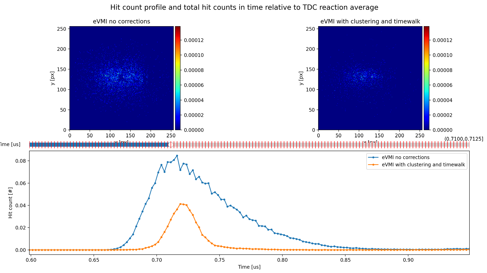
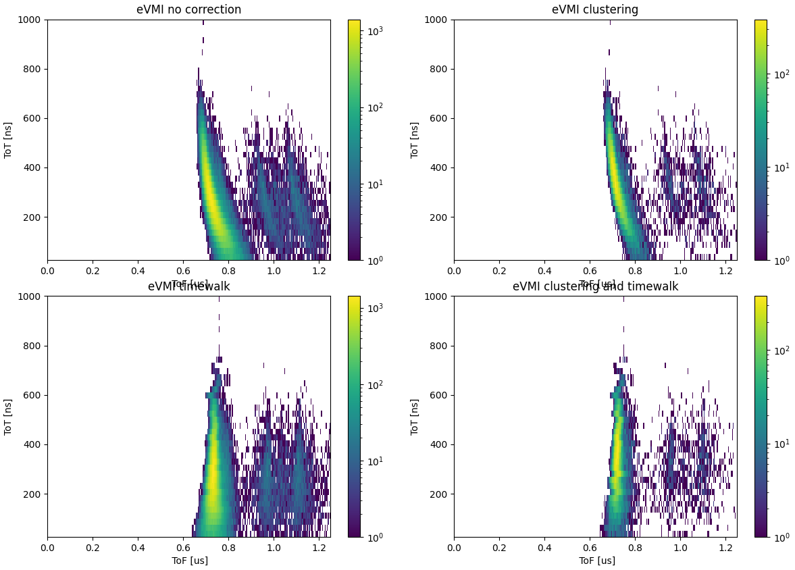
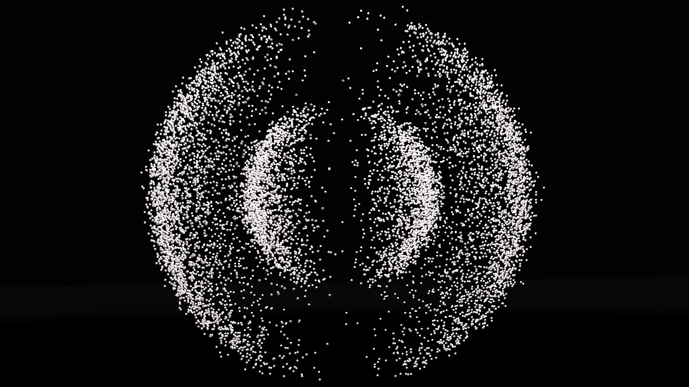

This post is an overview of my internship at ELI: Beamlines from the summer of 2023. The goal was to process data from a Tpx3 camera and visualize orbital structure using velocity map imaging (VMI).

## What is VMI and Tpx3

Useful articles:
<ul>
<li> VMI: <a href="https://iopscience.iop.org/article/10.1088/1361-6455/ac4b42/pdf">Three-dimensional (3D) velocity map imaging: from technique to application</a> 
<li> Tpx3 camera: <a href="https://pubs.aip.org/aip/rsi/article/88/11/113104/989932/Coincidence-velocity-map-imaging-using-Tpx3Cam-a"> Coincidence velocity map imaging using Tpx3Cam</a>
</ul>

## Analysis of data from TPX3 camera

### Profile in time

Shows places where electrons where detected in a specified time interval. There is also an overview of total hit count at the bottom.

### Data refinement - clustering and time walk

<ul>
<li> How to perform clustering and time walk?: <a href="https://pubs.aip.org/aip/rsi/article/88/11/113104/989932/Coincidence-velocity-map-imaging-using-Tpx3Cam-a"> Coincidence velocity map imaging using Tpx3Cam</a>
<li> Why perform time walk on TPX camera?: <a href="https://iopscience.iop.org/article/10.1088/1748-0221/11/12/C12065">USB 3.0 readout and time-walk correction method
for Timepix3 detector</a>
</ul>

## Visualizing patterns

Second part of the internship was about taking observed measured patterns emerging from orbital properties and visualizing them in Blender. Articles used:
<ul>
<li> <a href="https://iopscience.iop.org/article/10.1088/1361-6455/ac4b42/pdf">Three-dimensional (3D) velocity map imaging: from technique to application</a> 
<li> <a href="https://iopscience.iop.org/article/10.1088/0953-4075/47/12/124017"> Imaging the electronic structure of valence orbitals in the XUV ionization of aligned molecules</a>
</ul>

 
<video width=100% controls autoplay muted>
    <source src="detector_collision.mp4" type="video/mp4">
    Your browser does not support the video tag.  
</video>


