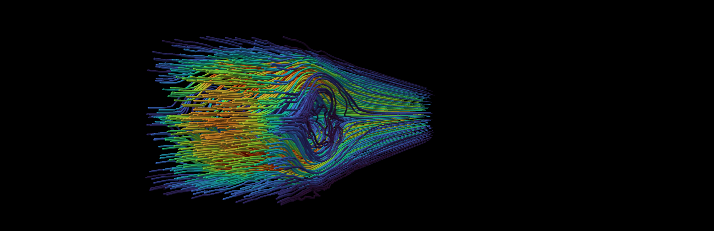
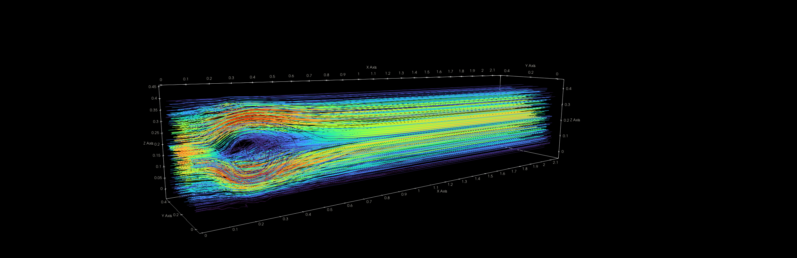

I have been working in the area of the lattice Boltzmann method (LBM) for my [bachelor project](https://dspace.cvut.cz/entities/publication/ed8a03a2-cdf0-451b-8a34-fa6ba8e272e3) and for my diploma thesis. Here is a very simple overview of it.

## LBM overview

Consider a model $\mathrm{D}3\mathrm{Q}q$ (dimension and quantity) with discrete velocities $\vec{c}_i \in \mathbb{R}^3$ for $i\in \lbrace 1,2,\ldots,q\rbrace$. 
This speed model approximates moving particles which would have microscopic velocity from $\mathbb{R}^3$ only on a finite set of velocities. Distribution of particles is denoted by $\vec{f}\in\mathbb{R}^q$ where each component correspond to one of the discrete velocities. Macroscopic variables in case without force can be obtained using equations
$$
\rho(\vec{x},t) = \sum_i f_i(\vec{x},t)
$$
for density and
$$
\rho(\vec{x},t) \vec{u}(\vec{x},t) = \sum_i f_i(\vec{x},t) \vec{c}_i
$$
for velocity.
This model has a set of weights $\vec{w}\in\mathbb{R}^q$ which are for this purpose are just the values when particles are at equilibrium with density $\rho = 1$ and macroscopic velocity $\vec{u} = \vec{0}$. [^theory] For a D3Q27 model with velocities from $\lbrace-1,0,1\rbrace^3$ the weights can be obtained from a D1Q3 model with velocities $(c_1, c_2,c_3) = (-1,0,1)$ which has weights $\vec{w} = (\frac{1}{6},\frac{2}{3},\frac{1}{6})^T$ by multiplying independent directions. For example velocity $\vec{c} = (-1,1,0)$ has weight $w=\frac{1}{6} \frac{1}{6} \frac{2}{3} = \frac{1}{54}$.

Add a lattice $\mathcal{X}$ with dimensions $N_1$, $N_2$ and $N_3$ defined as
$$
\mathcal{X} = \lbrace 0,1,\ldots,N_1-1\rbrace \times \lbrace 0,1,\ldots,N_2-1\rbrace \times \lbrace 0,1,\ldots,N_3-1\rbrace,
$$
with the time discretization $\mathcal{T} = (0,1,2,\ldots,T)$.

The Boltzmann equation with single relaxation time states that distributions $\vec{f}$ approach equilibrium and move in lattice according to their velocities $\vec{c}$. It can be written as interpolation
$$
f_i(\vec{x}+\vec{c}_i,t+1)  = \left(1-\frac{1}{\tau}\right)f_i(\vec{x},t)  + \frac{1}{\tau} f_i^{\mathrm{eq}}(\rho(\vec{x},t),\vec{u}(\vec{x},t))
$$
where $\tau \in (\frac{1}{2},1)$ is the relaxation time and a straightforward equilibrium approximation for D3Q27 (or D2Q9) is
$$
f_i^{\mathrm{eq}}(\rho,\vec{u}) = w_i \rho \left(1+3\vec{u}\cdot\vec{c}_i+\frac{9}{2} (\vec{u}\cdot\vec{c}_i)^2 - \frac{3}{2}\vec{u}\cdot\vec{u}\right).
$$

This is the basic theory without the boundary conditions which can be difficult to implement properly.

## The algorithm

Have two arrays $\mathcal{X}_1$ and $\mathcal{X}_2$ (this is called the AB streaming method).

0. set all values to equilibrium at density 1 and velocity $\vec{0}$
$$
f_i(\vec{x},0) = f_i^{\mathrm{eq}}(1,\vec{0})
$$
1. compute macroscopic variables $\rho$ and $\vec{u}$ at each lattice site in $\mathcal{X}_1$ $\rightarrow$ output them when needed
2. **Collision** evaluate this expression at $\mathcal{X}_1$
$$
f_i(\vec{x},t)  = \left(1-\frac{1}{\tau}\right)f_i(\vec{x},t)  + \frac{1}{\tau} f_i^{\mathrm{eq}}(\rho,\vec{u})
$$
3. **Streaming** set $f_i(\vec{x}+\vec{c}_i,t+1)$ from $\mathcal{X}_2$ to modified $f_i(\vec{x},t)$ from $\mathcal{X}_1$
4. apply boundary conditions
5. swap $\mathcal{X}_1 \leftrightarrow \mathcal{X}_2$ and go to step 1

Some lattice sites at the edges have to be reserved for boundary conditions which can be implemented as:
Simplest boundary conditions are:

- periodic - perform modulo operations on lattice indices
- wall - **full-way bounce-back** - swap $f_i$ and $f_j$ when $\vec{c}_j = - \vec{c}_i$ (*flip distribution function*)
- inflow - set equilibrium with a given inflow velocity and active density
- outflow - get unknown distributions from the closest lattice site, normalize to density 1 for pressure boundary condition[^pressure] $f_i \leftarrow \frac{f_i}{\sum_i f_i}$

## Example implemenetation

Here is [my ShaderToy implementation of the an equilibrium LBM](https://www.shadertoy.com/view/wcGBzw) which takes $\tau = 1$ which means that relaxation is ideal and distribution function reaches equilibrium after one iteration. This makes it easier to implement in a shader where one is constrained by amount of channels.

An implementation used to run the simulation for the preview is the [TNL-LBM](https://github.com/TNL-Project/TNL-LBM#).

## Additional renders

## References

[^theory]: there is actually much more math theory in this, see: [^kruger] and [On the convergence of certain Gauss-type quadrature formulas for unbounded intervals](http://nalag.cs.kuleuven.be/papers/ade/gauss/index.html)
[^kruger]: [The lattice Boltzmann Method, Principles and practice, Timm Krüger et al.](https://link.springer.com/book/10.1007/978-3-319-44649-3)
[^pressure]: pressure for weakly compressible fluids is linearly dependent on density
