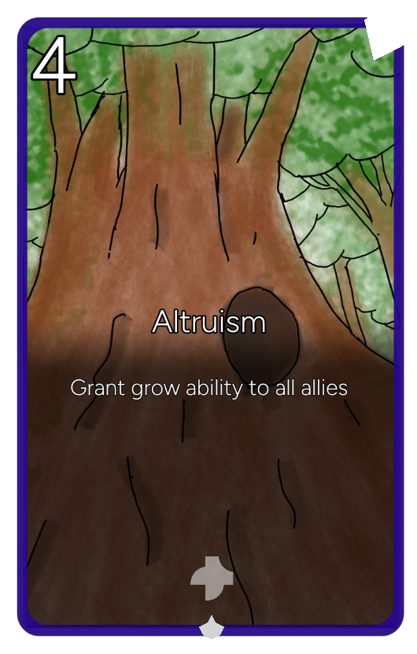

The goal of this project to create custom cards and rules in a card game similar to Hearthstone, Legends of Runeterra, or Gwent. The source code is available in [repository](https://codeberg.org/MarekOnd/phanes) with an [example mod](https://codeberg.org/MarekOnd/phanes-example-mod). Releases contain v0.1 builds for Linux and Android. The game offers singleplayer, multiplayer, and an automatic game (Bot vs Bot).

The game/tool is still WIP, contains many bugs, and core functions will be changed in the future.

## Preview of cards

| Unit card | Spell card |
|-|-|
|  |  |

Create cards with custom abilities using the resource system in Godot.

## Preview of deck building

<figure style="text-align:center;">
<video
    src="deck_building_preview.webm"
    autoplay
    muted
    loop
    playsinline
    style="width:auto">
</video>
</figure>

Create decks with no constraints.

## Preview of singleplayer

<figure style="text-align:center;">
<video
    src="normal_game_preview.webm"
    autoplay
    muted
    loop
    playsinline
    style="width:auto">
</video>
</figure>

Play against a bot in casual game or custom scenarios (this may also be used for puzzles in the future).

## Preview of multiplayer

<figure style="text-align:center;">
<video
    src="multiplayer_game_preview.webm"
    autoplay
    muted
    loop
    playsinline
    style="width:auto">
</video>
</figure>

Challenge friends across devices. 

## Preview of automatic game

<figure style="text-align:center;">
<video
    src="auto_game_preview.webm"
    autoplay
    muted
    loop
    playsinline
    style="width:auto">
</video>
</figure>

Planned to be used for training Bots and balancing of cards. 

---

*The glorious father of eternal Nyx, whom later-born mortals call Phanes; for he was the first to appear.* - [Argonautica of Orpheus, 15](https://el.wikisource.org/wiki/%CE%9F%CF%81%CF%86%CE%AD%CF%89%CF%82_%CE%91%CF%81%CE%B3%CE%BF%CE%BD%CE%B1%CF%85%CF%84%CE%B9%CE%BA%CE%AC)